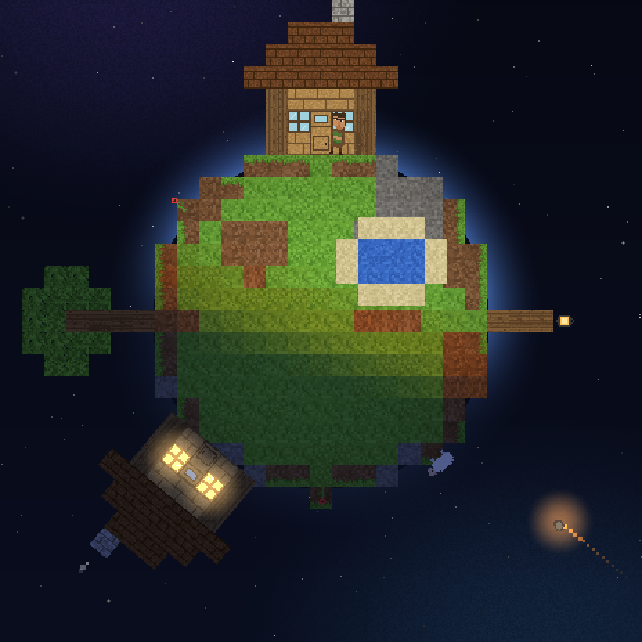

# ほしそだて (Planet Grow)

宇宙空間に浮かぶ小さな惑星を育てる Android アプリです。
最初は **家が一軒** と **住人が一人** だけ。住人は惑星の表面をてくてく歩いています。

見た目はマインクラフト風のドット絵で、**地球の時間とそのまま連動**します。
お昼にアプリを開けば太陽は真上に、夜に開けば星空の中で家の窓に明かりが灯っています。


左から 6:00 / 12:00 / 18:30 / 23:00。太陽は現実の 24 時間かけて惑星を一周し、
日の当たっている側だけが明るくなります。

## 遊びかた

### 待つ

**1 日に 2 回ほど、空から何かが降ってきます。**

| 飛来するもの | 手に入る資源 |
| --- | --- |
| 隕石 | **鉱石** — 建物の材料 |
| 宇宙のチリ | **たね** — 植物のたねや生物の卵 |
| 彗星のチリ | **氷** — 溶けて水になる |

アプリを閉じている間も時間は進みます。次に開いたときに
「留守の間に◯回の飛来」とまとめて受け取れます。

### つくる

資源が貯まったら **つくる** を押して、何を作るか選びます。

| つくるもの | 材料 | できるまで |
| --- | --- | --- |
| 花を植える | たね1 | 1時間 |
| 街灯を立てる | 鉱石2 | 3時間 |
| 池をつくる | 氷3 | 4時間 |
| 木を育てる | たね2 氷1 | 8時間 |
| 卵をかえす | たね3 氷1 | 10時間 |
| 家を建てる | 鉱石5 たね1 | 16時間 |

**作りはじめてからできあがるまでも実時間です。** 家は足場を組んで下から少しずつ建ち、
木は芽から若木を経て育ちます。できあがると住人や生きものが増え、
ものが増えるほど惑星そのものも少しずつ大きくなります。



家が2軒、木、池、街灯、ヒツジまで育った惑星。1軒は建設中で足場がかかっています。

## 特徴

- **地球時間と連動した 1 日** — 端末のローカル時刻がそのまま惑星の時刻。
  0 時に太陽が真下、6 時に左、12 時に真上、18 時に右。球面の陰影で昼と夜が分かれます。
- **住人の暮らし** — 日なたを歩き、自分の家のあたりが暗くなると家に帰って眠ります。
  寝ている間は家の窓が暖かく光り、煙突からは煙が出ています。
- **本物の月齢** — 月は実際の月齢にあわせて満ち欠けします (マイクラと同じ 8 段階)。
- **画像アセットを一切使わない** — ブロックのテクスチャも住人も飛来物も、すべてコードで描いています。
  そのぶん APK は小さく、どの端末でも同じ見た目になります。

## 入れかた

### できあがった APK をそのまま入れる

push のたびに CI が debug APK をビルドして、固定 URL の Release に置きます。
スマホのブラウザで下のリンクを開けばそのままインストールできます
(端末の設定で「提供元不明のアプリ」のインストールを許可してください)。

**<https://github.com/ookimitsuru-ctrl/desktop-tutorial/releases/download/planetgrow-latest/planetgrow-debug.apk>**

```bash
# PC から入れる場合
curl -LO https://github.com/ookimitsuru-ctrl/desktop-tutorial/releases/download/planetgrow-latest/planetgrow-debug.apk
adb install -r planetgrow-debug.apk
```

### Android Studio でビルドする

1. Android Studio でこのフォルダを **Open**
2. Gradle Sync が終わるのを待つ
3. 実機 / エミュレータ (Android 8.0 / API 26 以上) を選んで Run ▶

```bash
./gradlew assembleDebug   # コマンドラインならこれだけ
```

## 画面の見かた

| 表示 | 意味 |
| --- | --- |
| 左上「N日目」 | 惑星が生まれてからの日数 (地球の日付が変わると増える) |
| 左上の時刻 | 端末のローカル時刻。太陽の位置と一致します |
| 右上 | 手持ちの資源と、次の飛来までの時間 |
| 下 | 建設中のものと残り時間 / **つくる** ボタン |

## 数字を変える

遊びの数字は `app/src/main/java/com/example/planetgrow/core/Game.kt` にまとまっています。

- `SkyFall.SLOT_MILLIS` — 飛来の間隔 (既定 12 時間 = 1 日 2 回)
- `SkyFall.arrivalForSlot` — 何が落ちてくるかの割合と量
- `Recipes.all` — 作れるもの・材料・できるまでの時間
- `PlanetState.radius()` — ものが増えたときの惑星の大きさ

## 仕組み

すべて 1 ブロック = 16px のドット絵として **ソフトウェアで 1 枚の画像に描いてから**、
画面いっぱいに最近傍拡大しています。こうするとどの端末でもドットの大きさが揃い、
マインクラフトらしいかっちりした見た目になります。

惑星は「外から見た球」として描いていて、地表のブロックには球面の法線から求めた陰影が
かかります。中身 (断面) は描かないので、手前に見えている面はこれから建物を置いていける
余白になっています。

```
app/src/main/java/com/example/planetgrow/
├── MainActivity.kt      画面 (Jetpack Compose)・HUD・つくるパネル
├── Prefs.kt             惑星の状態の保存
└── core/                ここは Android に依存しない純 Kotlin
    ├── Game.kt          資源・飛来の予定表・レシピ・惑星の状態と保存形式
    ├── World.kt         地形・住人や生きものの動き・飛来物と粒子
    ├── Scene.kt         宇宙・惑星・昼夜のライティングを 1 枚に描く
    ├── Structures.kt    家・木・街灯・池をブロックで組み立てる
    ├── Textures.kt      ブロックのテクスチャを手続き的に生成
    ├── Sprites.kt       住人・ヒツジ・太陽・月・飛来物のドット絵
    └── Pixels.kt        ドット絵の描画 (回転・アルファ・グロー)
```

飛来は「惑星の誕生時刻」を種にした決まった予定表なので、アプリを閉じていても
後から「その間に何が落ちたか」を正しく計算できます。

## 惑星の絵をデスクトップで確認する (開発用)

Android SDK が無くても、アプリ本体とまったく同じ描画コードで PNG を書き出せます。

```bash
cd preview
../gradlew run                                   # 生まれたての惑星を 6 つの時刻で
../gradlew run --args="out 3 06:00 12:00 23:00"  # 育った惑星 (0〜3) の指定時刻
```

`preview/out/` に画像が出ます (`*_zoom.png` はドット確認用の拡大版)。
`preview/` はアプリ本体のソースをそのまま参照しているので、絵がずれることはありません。

## 必要環境

- Android 8.0 (API 26) 以上
- Android Gradle Plugin 8.3.2 / Kotlin 1.9.24 / Jetpack Compose (BOM 2024.05.00)
- JDK 17
