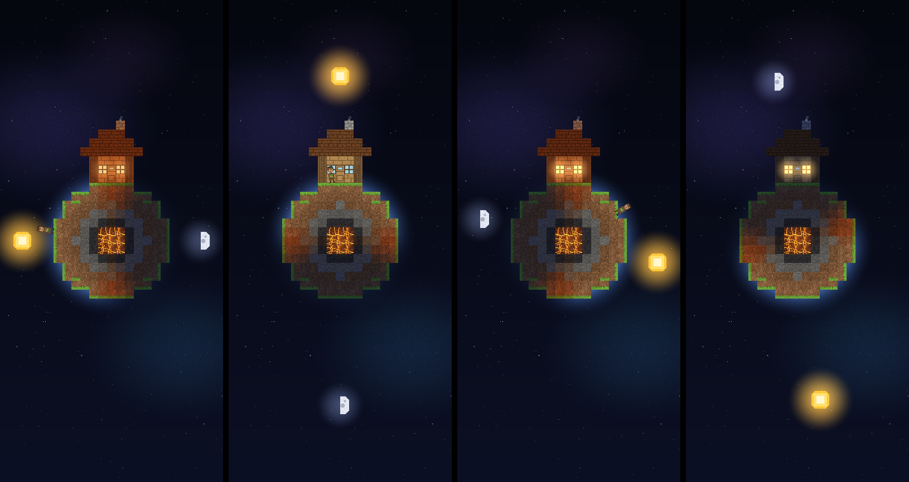
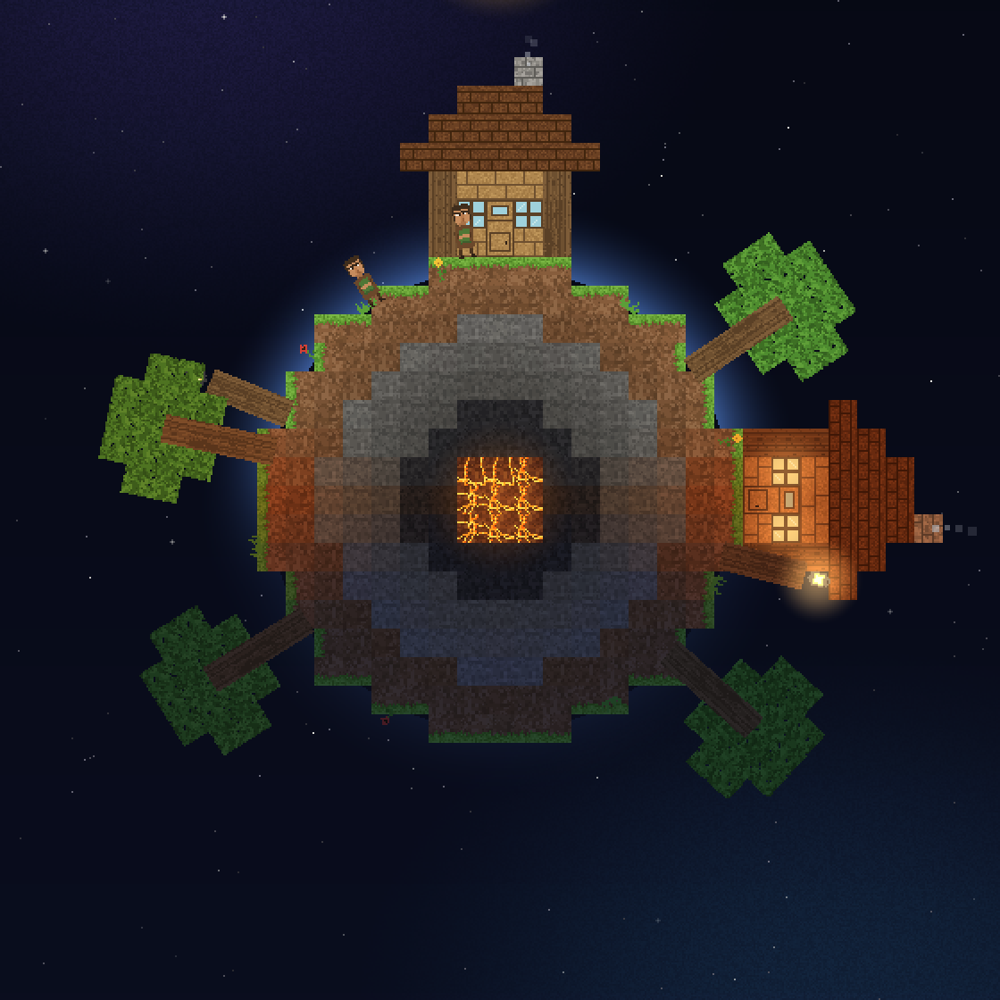

# ほしそだて (Planet Grow)

宇宙空間に浮かぶ小さな惑星を育てる Android アプリです。
最初は **家が一軒** と **住人が一人** だけ。惑星は家のおよそ 2 倍の大きさで、
住人は惑星の表面をてくてく歩いています。

見た目はマインクラフト風のドット絵で、**地球の時間とそのまま連動**します。
お昼にアプリを開けば太陽は真上に、夜に開けば星空の中で家の窓に明かりが灯っています。



左から 6:00 / 12:00 / 18:30 / 23:00。太陽は現実の 24 時間かけて惑星を一周します。

## 特徴

- **地球時間と連動した 1 日** — 端末のローカル時刻がそのまま惑星の時刻。
  0 時に太陽が真下、6 時に左、12 時に真上、18 時に右。日の当たる側だけが明るくなります。
- **住人の暮らし** — 日なたを歩き、自分の家のあたりが暗くなると家に帰って眠ります。
  寝ている間は家の窓が暖かく光り、煙突からは煙が出ています。
- **本物の月齢** — 月は実際の月齢にあわせて満ち欠けします (マイクラと同じ 8 段階)。
- **1 日ごとに育つ惑星** — 起動した日を 1 日目として、日が経つと草が生え、木が育ち、
  街灯が立ち、やがて家と住人が増えて惑星そのものも大きくなります。
- **画像アセットを一切使わない** — ブロックのテクスチャも住人も、すべてコードで描いています。
  そのぶん APK は小さく、どの端末でも同じ見た目になります。



20 日目。木が生え、反対側にも家が建ち、住人が 2 人になった惑星。

## 動かし方

### Android Studio

1. Android Studio でこのフォルダを **Open**
2. Gradle Sync が終わるのを待つ
3. 実機 / エミュレータ (Android 8.0 / API 26 以上) を選んで Run ▶

### コマンドライン

```bash
./gradlew assembleDebug
# app/build/outputs/apk/debug/app-debug.apk ができます
adb install -r app/build/outputs/apk/debug/app-debug.apk
```

### GitHub Actions からできあがった APK を取る

`.github/workflows/android-build.yml` が push のたびに debug APK をビルドします。
Actions の実行結果ページ下部 **Artifacts** の `planetgrow-debug-apk` からダウンロードできます。

## 画面の見かた

| 表示 | 意味 |
| --- | --- |
| 左上の「N日目」 | 初回起動日からの経過日数 (地球の日付が変わると増える) |
| 左上の時刻 | 端末のローカル時刻。太陽の位置と一致します |
| 左下 | 今の住人の数と木の本数 |

**日付の部分を長押し**すると 1 日ずつ先の惑星を覗けます (何日も待たずに成長を確認できます)。
タップすると今日に戻ります。

## 成長のしかた

`app/src/main/java/com/example/planetgrow/core/World.kt` の `Growth` に全部まとまっています。
数字を書き換えれば成長の速さも内容も変えられます。

| 日 | 起きること |
| --- | --- |
| 1 日目 | 家が一軒・住人 1 人 (半径 6.5 ブロック) |
| 2〜4 日目 | 草が生え、最初の木が育ち、花が咲く |
| 6 日目〜 | 惑星が一回り大きくなる (半径 7.5)、木が増える |
| 8 日目〜 | 街灯が立つ (夜に光ります) |
| 15 日目〜 | 惑星がさらに大きく (半径 8.5)、2 軒目の家と 2 人目の住人 |
| 30 日目〜 | 半径 9.5、3 軒目の家と 3 人目の住人 |

## 仕組み

すべて 1 ブロック = 16px のドット絵として **ソフトウェアで 1 枚の画像に描いてから**、
画面いっぱいに最近傍拡大しています。こうするとどの端末でもドットの大きさが揃い、
マインクラフトらしいかっちりした見た目になります。

```
app/src/main/java/com/example/planetgrow/
├── MainActivity.kt      画面 (Jetpack Compose) と 1 フレームごとの進行
├── Prefs.kt             惑星の誕生日 (初回起動日) の保存
└── core/                ここは Android に依存しない純 Kotlin
    ├── Pixels.kt        ドット絵の描画 (回転・アルファ・グロー)
    ├── Textures.kt      ブロックのテクスチャを手続き的に生成
    ├── Sprites.kt       住人・太陽・月・花のドット絵
    ├── Structures.kt    家・木・街灯をブロックで組み立てる
    ├── World.kt         惑星の地層・成長スケジュール・住人の行動
    └── Scene.kt         宇宙・惑星・昼夜のライティングを 1 枚に描く
```

惑星はブロックを円形に並べた「輪切り」で、外側から草・土・石・深層岩・マグマの層になっています。
太陽の方向との内積で地表のブロックの明るさを決めているので、昼の側だけが明るく光ります。

## 惑星の絵をデスクトップで確認する (開発用)

Android SDK が無くても、アプリ本体とまったく同じ描画コードで PNG を書き出せます。

```bash
cd preview
../gradlew run                                     # 1日目を 6 つの時刻で
../gradlew run --args="out 20 06:00 12:00 23:00"   # 20日目の指定時刻
```

`preview/out/` に画像が出ます (`*_zoom.png` はドット確認用の拡大版)。
`preview/` はアプリ本体のソースをそのまま参照しているので、絵がずれることはありません。

## 必要環境

- Android 8.0 (API 26) 以上
- Android Gradle Plugin 8.3.2 / Kotlin 1.9.24 / Jetpack Compose (BOM 2024.05.00)
- JDK 17
