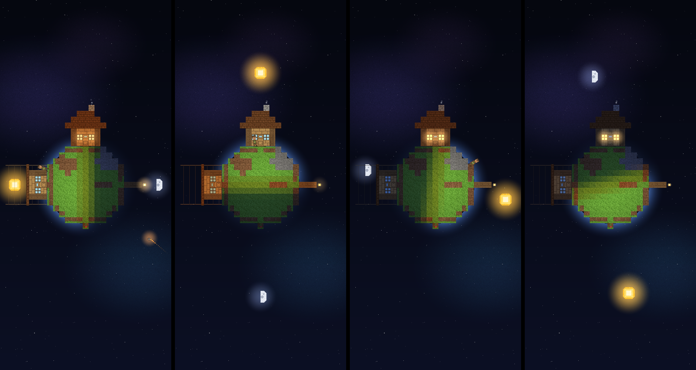
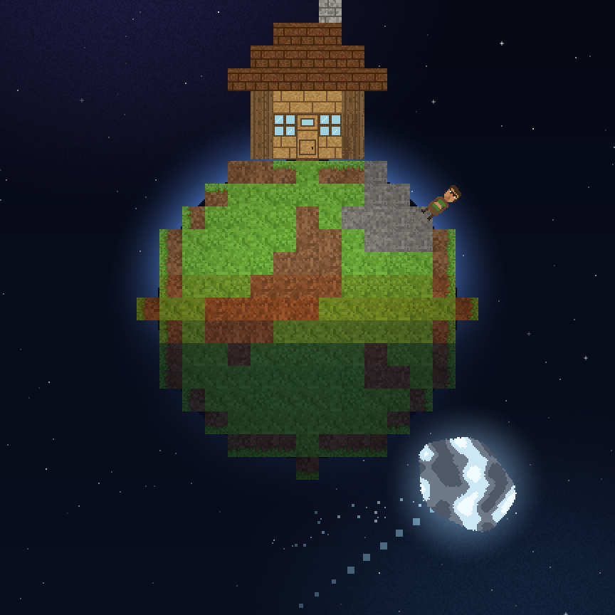
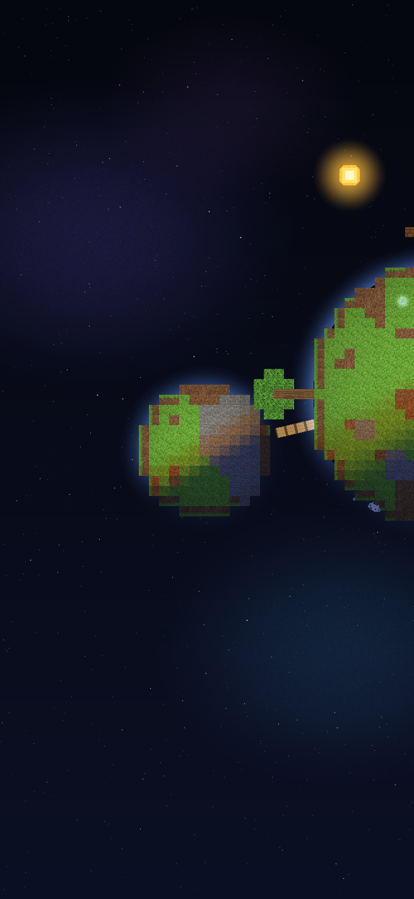

# ほしそだて (Planet Grow)

宇宙空間に浮かぶ小さな惑星を育てる Android アプリです。
最初は **家が一軒** と **住人が一人** だけ。住人は惑星の表面をてくてく歩いています。

見た目はマインクラフト風のドット絵で、**地球の時間とそのまま連動**します。
お昼にアプリを開けば太陽は真上に、夜に開けば星空の中で家の窓に明かりが灯っています。



左から 6:00 / 12:00 / 18:30 / 23:00。太陽は現実の 24 時間かけて惑星を一周し、
日の当たっている側だけが明るくなります。

## 遊びかた

### タイトル画面

アプリを開くと、まず自分の惑星のスナップショットを背景にしたタイトル画面が出ます。
タイトルの文字「ほしそだて」は、惑星を作っているのと同じ草・土・石・丸太・板のブロックの
テクスチャで塗ってあります (1文字ごとに違うブロック)。

- **ほしにもどる** — 育てている惑星の続きから遊びます
- **はじめから** — 惑星を捨てて、生まれたての星からやり直します。
  押し間違い防止に「ほんとうに消す？」ともう一度聞きます

### 待つ

**1 時間に 1 回ほど、空から何かが降ってきます。** 降ってくる様子は種類ごとにまったく違います。

| 飛来するもの | 手に入る資源 | 降ってくる様子 |
| --- | --- | --- |
| 隕石 | **鉱石** — 建物の材料 | 一直線に落ちてきて、地表に突き刺さる |
| 宇宙のチリ | **たね** — 植物のたねや生物の卵 | 綿毛のついた種が、ふわふわと揺れながらゆっくり漂ってくる |
| 彗星 | **氷** — 溶けて水になる | 家ほどの大きさの氷の塊が惑星のすぐ近くをかすめて飛び、キラキラした氷を地表に降らせる |

アプリを閉じている間も時間は進みます。次に開いたときに
「留守の間に◯回の飛来」とまとめて受け取れます。



彗星が通り過ぎながら、氷のきらめきを地表に降らせているところ。

### つくる

資源が貯まったら **つくる** を押して、何を作るか選びます。

| つくるもの | 材料 | できるまで |
| --- | --- | --- |
| 花を植える | たね1 | 1時間 |
| 池をつくる | 氷3 | 4時間 |
| 畑をつくる | たね2 氷1 | 2時間 |
| 卵をかえす | たね3 氷1 | 2時間 (**家畜が3頭**うまれる) |
| 橋をかける | 鉱石10 氷2 | 24時間 |

**作りはじめてからできあがるまでも実時間です。** **花と家畜の種類は選べません** —
できあがったときにどんな花が咲くか、ヒツジかニワトリかブタかウシかが決まります。
花は 1 回の植え付けで何本かがまとまって咲きます。「卵をかえす」は 1 回で家畜が **3 頭**
まとめてうまれます (足りるだけの空きが惑星の面に無ければ、入る分だけになります)。

家・街灯・木は「つくる」からは無くなりました。**最初からある家と住人はそのまま**です
(惑星は最初から家 1 軒・住人 1 人つきで、それ以上は増えません)。

### 家畜を養う

**惑星が生まれて 1 週間経つと、家畜が作物を食べはじめます。**
畑をつくっておかないと食べるものが尽きて、家畜は元気が無くなってしまいます。

- 畑ひとつが、種まきから実るまで **2 時間ほど**かけて作物を 1 つ実らせる
- 家畜 1 匹が 2 週間に 1 つ食べる (畑 1 つでだいたい 2 匹ぶんを養えます)

池・畑・家畜は、みんな惑星の**手前の面**に並びます。

### 宇宙船の襲来

**家畜がいると、1 日に 2 度ほどの割合で宇宙船が近づいてきます。** 結果は運まかせで 3 通り:

| 結果 | 何が起きるか |
| --- | --- |
| 襲われる | **家畜がいれば 1 頭さらわれます。家畜が 1 頭もいなければ**、代わりに地表の **1/4 が荒れ地** になる (時間が経つと自然に元どおりになります) |
| 撤退する | 何も起きない。まれに鉱石・たね・氷を残していく |
| 追い払う | 宇宙船を乗り捨てて逃げていく。**レア卵**を手に入れる |

**花が多いほど「追い払う」確率が上がります**
(虫が苦手な宇宙人が、花に集まる虫に驚いて逃げていく、というイメージです)。
逆に花が少ないと襲われやすくなります。家畜がいなければ宇宙船は来ません。

**レア卵は、惑星のふちが空き次第、自動でペットが1頭孵ります** (孵化中は「卵」の見た目)。
家畜と違ってペットは**惑星のふちに立ち**、宇宙船にさらわれることもありません。
まだ孵化中のレア卵があれば、次のレア卵は空きができるまで在庫として持ち越されます。

### 惑星が育つ

**地殻変動が 3 日ごとに 1 段階ずつ進み、3 段階 (9 日) で 1 周期です。**

| 段階 | 何が起きるか |
| --- | --- |
| 1 段階目 (3 日目) | 惑星のふちに**火山**が出現する。そこに花があれば空き地に移り、空き地が無ければ他の花と合体してひとまわり大きくなる |
| 2 段階目 (6 日目) | その火山が**活発化**し、噴石と噴煙をあげて噴火する (火口は昼夜を問わず赤く光り続けます) |
| 3 段階目 (9 日目) | 惑星が少しだけ大きくなる (以前と同じ量) |

これが **13 周期 (117 日) 繰り返されると成長が止まります**。
止まったときの大きさは**スタート時のちょうど直径 2 倍**。
大きくなるほど建てられる場所が増えていきます。
火山は家や木と同じく、一度出現すると**そのまま残り続けます**。

成長が止まると、こんどは**衛星ができはじめます**。衛星は生まれたときは岩のかけらほどですが、
**1 ヶ月かけてスタート時の星と同じ大きさまで育ち、人が住める惑星になります**。
育ちきった衛星には **橋をかけて** つなげられます (橋がつながると衛星はその面を向けたまま止まります)。

### 見に行く

**衛星をタップすると、そこへカメラが移動します。** 惑星に戻るときは惑星をタップ。
画面の外にある天体は、画面のふちに光る印で位置を知らせます (印をタップしても移動できます)。



衛星に寄ったところ。右が惑星、左が育ちきった衛星で、あいだに橋がかかっています。

## 特徴

- **宇宙船との駆け引き** — 家畜を育てると宇宙船が寄ってくるようになります。
  花を増やして追い払うか、家畜がさらわれるのを覚悟するか、運まかせの駆け引きです。
- **地球時間と連動した 1 日** — 端末のローカル時刻がそのまま惑星の時刻。
  0 時に太陽が真下、6 時に左、12 時に真上、18 時に右。球面の陰影で昼と夜が分かれます。
- **住人の暮らし** — 日なたを歩き、自分の家のあたりが暗くなると家に帰って眠ります。
  寝ている間は家の窓が暖かく光り、煙突からは煙が出ています。
- **本物の月齢** — 月は実際の月齢にあわせて満ち欠けします (マイクラと同じ 8 段階)。
- **宇宙の遠景演出** — ゲームの進行には関係ない、見ているだけの賑やかしです。
  - 遠くの彗星が、まるまる 1 日 (地球時間) かけて背景をゆっくり横切ります。惑星が生まれてからの日数で軌道が変わるので、毎日同じ道すじではありません
  - たまに UFO (アダムスキー型) が横切っていきます
  - ごくまれに、自分の星と同じような作りの、よその惑星が遠くを通り過ぎていきます
- **画像アセットを一切使わない** — ブロックのテクスチャも住人も飛来物も、すべてコードで描いています。
  そのぶん APK は小さく、どの端末でも同じ見た目になります。

## 入れかた

### できあがった APK をそのまま入れる

push のたびに CI が debug APK をビルドして、固定 URL の Release に置きます。
スマホのブラウザで下のリンクを開けばそのままインストールできます
(端末の設定で「提供元不明のアプリ」のインストールを許可してください)。

**<https://github.com/ookimitsuru-ctrl/desktop-tutorial/releases/download/planetgrow-latest/planetgrow-debug.apk>**

```bash
# PC から入れる場合
curl -LO https://github.com/ookimitsuru-ctrl/desktop-tutorial/releases/download/planetgrow-latest/planetgrow-debug.apk
adb install -r planetgrow-debug.apk
```

**ダウンロードが途中で止まる・失敗するときは:**

- **リンクを LINE/X/Instagram などの中のブラウザで開いていないか確認する。** アプリ内蔵の
  ブラウザは大きめのファイルのダウンロードで失敗しやすいので、リンクをコピーして
  Chrome など通常のブラウザに貼り直してから開いてください。
- **push した直後は少し待つ。** この Release は push のたびに中身が置き換わるので、
  ちょうど置き換え中にダウンロードするとファイルが壊れることがあります。数分待って
  もう一度試してください。
- **同じ中身の .zip 版を試す。** 一部のネットワークや端末は `.apk` の拡張子だけを
  理由にダウンロードを止めることがあります。
  <https://github.com/ookimitsuru-ctrl/desktop-tutorial/releases/download/planetgrow-latest/planetgrow-debug-apk.zip>
  をダウンロードして展開し、中の `planetgrow-debug.apk` を開いてください。
- **Wi-Fi とモバイル回線を入れ替えて試す。** 片方だけでダウンロードが途切れる場合があります。

**ダウンロードできたのに「インストールできない」ときは:**

- **前に入れた「ほしそだて」を一度アンインストールしてから、入れ直してください。**
  以前は CI がビルドのたびに違うデバッグ署名鍵を自動生成していたため、前回インストール
  したバージョンと署名が合わず、上書きインストールが拒否されることがありました
  (「アプリはインストールされませんでした」など)。署名鍵をリポジトリに固定したので、
  今回一度アンインストールして入れ直せば、次回以降のアップデートはこの操作なしで
  上書きできるはずです。
- 「提供元不明のアプリ」の許可が、実際にダウンロードに使ったアプリ (ブラウザや
  ファイルマネージャ) に対して有効になっているか確認してください。
- 端末の空き容量を確認してください。

### Android Studio でビルドする

1. Android Studio でこのフォルダを **Open**
2. Gradle Sync が終わるのを待つ
3. 実機 / エミュレータ (Android 8.0 / API 26 以上) を選んで Run ▶

```bash
./gradlew assembleDebug   # コマンドラインならこれだけ
```

## 画面の見かた

| 表示 | 意味 |
| --- | --- |
| 左上「N日目」 | 惑星が生まれてからの日数 (地球の日付が変わると増える) |
| 左上の時刻 | 端末のローカル時刻。太陽の位置と一致します |
| 左上「惑星が育つまで」 | 次に惑星が大きくなるまでの時間 (9 日ごと) |
| 左上「衛星N」 | 衛星の育ち具合 |
| 右上 | 手持ちの資源と、次の飛来までの時間 |
| 下 | 知らせ・建設中のものと残り時間 / **つくる** ボタン |
| 画面のふちの光る点 | 画面の外にある惑星や衛星の方角 (タップで移動) |

## 数字を変える

遊びの数字は `app/src/main/java/com/example/planetgrow/core/Game.kt` にまとまっています。

- `SkyFall.SLOT_MILLIS` — 飛来の間隔 (既定 1 時間に 1 回)
- `SkyFall.arrivalForSlot` — 何が落ちてくるかの割合と量
- `Recipes.all` — 作れるもの・材料・できるまでの時間
- `PlanetState.TECTONIC_TICK_MILLIS` / `RADIUS_PER_PERIOD` / `GROWTH_PERIODS` — 地殻変動の速さ (既定 3 日ごと) と、止まるまでの周期数
- `PlanetState.VOLCANO_ACTIVE_AFTER` — 火山が出現してから活発化する (噴火する) までの時間
- `PlanetState.SATELLITE_INTERVAL` / `MAX_SATELLITES` — 衛星が生まれる間隔と数
- `Satellite.MATURE_MILLIS` — 衛星が育ちきるまで (既定 1 ヶ月)
- `PlanetState.CROP_PERIOD_MILLIS` / `EAT_PERIOD_MILLIS` — 畑の実りと食べる速さ
- `PlanetState.ALIEN_INTERVAL_MILLIS` — 家畜がいるときの宇宙船の襲来間隔 (既定 12 時間 = 1 日 2 度)
- `PlanetState.WASTELAND_ARC_DEG` / `WASTELAND_HEAL_MILLIS` — 荒れ地の広さと治るまでの時間
- `PlanetState.PET_HATCH_MILLIS` — レア卵からペットが孵るまでの時間
- `PlanetState.rollAlienOutcome()` — 花の本数が「攻撃/撤退/追い払う」の確率をどう動かすか

## 仕組み

すべて 1 ブロック = 16px のドット絵として **ソフトウェアで 1 枚の画像に描いてから**、
画面いっぱいに最近傍拡大しています。こうするとどの端末でもドットの大きさが揃い、
マインクラフトらしいかっちりした見た目になります。

惑星は「外から見た球」として描いていて、地表のブロックには球面の法線から求めた陰影が
かかります。中身 (断面) は描かないので、手前に見えている面は池や畑を置く場所として使っています。

画面には見ている天体のまわりだけを映し、衛星へはカメラが移動して見に行きます。
それでも場面が広くなったときは 1 ブロックを 8px に落として (ドット絵を半分に縮小して) 描きます。

```
app/src/main/java/com/example/planetgrow/
├── MainActivity.kt      画面 (Jetpack Compose)・HUD・つくるパネル
├── Prefs.kt             惑星の状態の保存
└── core/                ここは Android に依存しない純 Kotlin
    ├── Game.kt          資源・飛来の予定表・レシピ・衛星・惑星の状態と保存形式
    ├── World.kt         地形・住人や生きものの動き・飛来物と粒子
    ├── Scene.kt         宇宙・惑星・昼夜のライティングを 1 枚に描く
    ├── Structures.kt    家・木・街灯・池・火山をブロックで組み立てる
    ├── Textures.kt      ブロックのテクスチャを手続き的に生成
    ├── Sprites.kt       住人・生きもの・太陽・月・飛来物・遠景演出のドット絵
    └── Pixels.kt        ドット絵の描画 (回転・アルファ・グロー)
```

飛来は「惑星の誕生時刻」を種にした決まった予定表なので、アプリを閉じていても
後から「その間に何が落ちたか」を正しく計算できます。

## 惑星の絵をデスクトップで確認する (開発用)

Android SDK が無くても、アプリ本体とまったく同じ描画コードで PNG を書き出せます。

```bash
cd preview
../gradlew run                                   # 生まれたての惑星を 6 つの時刻で
../gradlew run --args="out 5 06:00 12:00 23:00"  # 育ち具合 0〜5 の指定時刻
                                                 # 4 以降は衛星つき
```

`preview/out/` に画像が出ます (`*_zoom.png` はドット確認用の拡大版)。
`preview/` はアプリ本体のソースをそのまま参照しているので、絵がずれることはありません。

## デバッグ: 時間と演出の頻度を早回しする

**現在は実時間どおりで動いています** (1 日 = 24 時間)。
動作確認のために早回ししたいときは、以下を変えてください。

### 1 日の長さ

`core/Game.kt` の `GameTime.SCALE` で、アプリ内の時間の進み方をまとめて早回しできます。

```kotlin
var SCALE: Float = 1f   // 1 = 実時間どおり。24 なら1日が1時間、96 なら1日が15分
```

太陽・月の動き、地殻変動、農業、飛来、宇宙船の襲来、建設の進み具合はすべてこの1箇所を
基準にしているので、数字を変えるだけで一括して速さが変わります。
実時間では、畑の作物は 2 時間、地殻変動は 3 日ごと (9 日で 1 周期・117 日で成長が止まる)、
宇宙船は 1 日に 2 度、資源の飛来は 1 時間おきです。

**画面のお知らせ (「隕石が落ちてきた」など) の表示時間だけは実時間のまま**にしてあります。
早回し中でもメッセージが一瞬で消えて読めない、ということが無いようにするためです。

### 遠景演出 (UFO・よその惑星) の出現頻度

こちらは `GameTime` と関係なく実時間で進むので、別に `core/Scene.kt` の
`drawUfo()` / `drawFarPlanetDecor()` にある `ufoWait` / `farPlanetWait` の
初期値・再抽選の範囲で調整します。

| | 間隔 |
| --- | --- |
| UFO | 40〜115 秒おき |
| よその惑星 | 100〜260 秒おき |

見た目をすぐ確かめたいときだけ、一時的にここを短くしてください。

## 必要環境

- Android 8.0 (API 26) 以上
- Android Gradle Plugin 8.3.2 / Kotlin 1.9.24 / Jetpack Compose (BOM 2024.05.00)
- JDK 17
